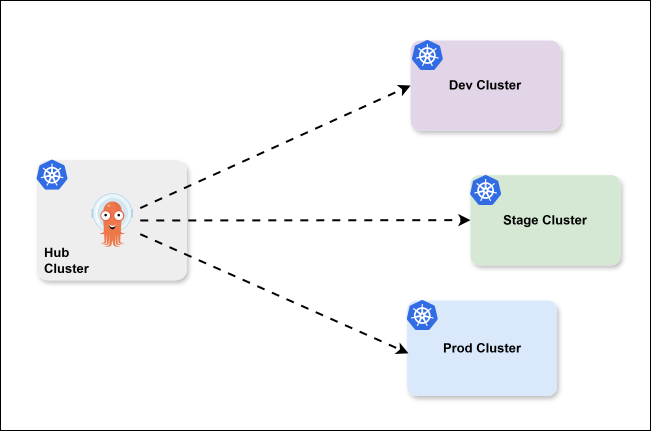
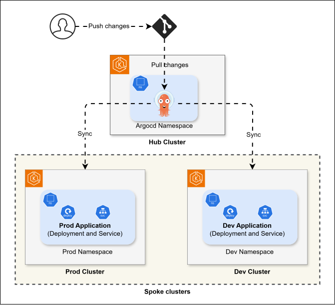
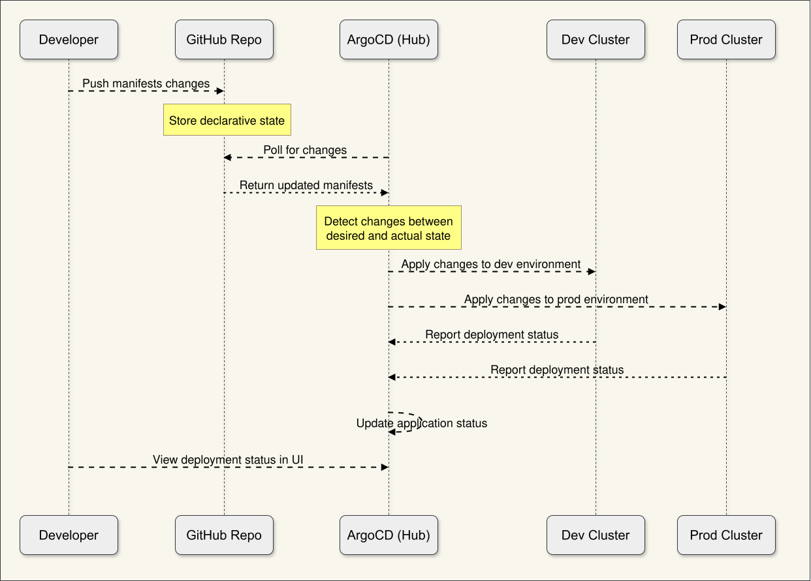
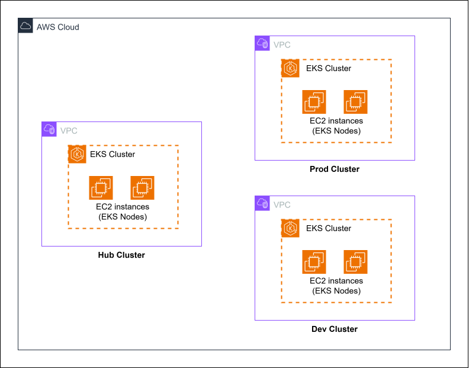

# ArgoCD Multi-Cluster Deployment in AWS with Hub and Spoke Model


GitOps has emerged as a powerful paradigm for managing Kubernetes deployments using Git as the single source of truth. ArgoCD, a declarative GitOps continuous delivery tool for Kubernetes, enables this approach by automatically synchronizing the desired state in Git with the actual state in your clusters.



This project implements a multi-cluster deployment architecture using the "hub and spoke" model with ArgoCD. In this model, a central hub cluster hosts the ArgoCD control plane, which manages deployments across multiple environment-specific spoke clusters (development, staging, and production etc.). This approach provides a unified management plane while maintaining clear separation between environments.

We'll provision all infrastructure using Amazon EKS (Elastic Kubernetes Service) with the `eksctl` command-line tool for simplicity. Our application will be a basic Node.js web service that we'll deploy across development and production environments.

## Project Overview

### Architecture



Our implementation consists of three EKS clusters:
- **Hub Cluster**: Central management cluster hosting ArgoCD
- **Development Cluster**: For development and testing
- **Production Cluster**: For production workloads

ArgoCD in the hub cluster will be configured to deploy our application to both the development and production clusters, with environment-specific configurations.

### Components

1. **Infrastructure**:
   - 3 EKS Clusters (hub, dev, prod)
   - GitHub repository for configuration

2. **ArgoCD**:
   - Installed on the hub cluster
   - Application definitions for dev and prod environments

3. **Application**:
   - Simple Node.js web service
   - Custom Docker image
   - Environment-specific configurations

### Repository Structure

```
argocd-multicluster/
├── manifests/
│   ├── dev/
│   │   ├── namespace.yaml
│   │   ├── deployment.yaml
│   │   └── service.yaml
│   └── prod/
│       ├── namespace.yaml
│       ├── deployment.yaml
│       └── service.yaml
└── argocd/
    ├── dev-app.yaml
    └── prod-app.yaml
```


### Sequence diagram

This sequence diagram illustrates the GitOps workflow:



- Developer pushes changes to GitHub
- ArgoCD polls the repository for changes
- When changes are detected, ArgoCD applies them to both clusters
- The clusters report status back to ArgoCD
- The developer can view the deployment status in the ArgoCD UI

## Prerequisites

### 1. AWS account with appropriate permissions
- Get your credentials and configure AWS: 

    ```bash
    aws configure
    ```

    Provide access key, secret key, region etc. 

    


### 2. `kubectl` command-line tool

-  Download the kubectl Binary using:

    ```sh
    curl -LO "https://dl.k8s.io/release/$(curl -L -s https://dl.k8s.io/release/stable.txt)/bin/linux/amd64/kubectl"
    ```

- Make the Binary Executable and Move the kubectl binary to `/usr/local/bin`:

    ```sh
    chmod +x kubectl
    sudo mv kubectl /usr/local/bin/
    ```

- Verify the Installation:

    ```sh
    kubectl version --client
    ```


### 3. `eksctl` command-line tool


- `eksctl` is a command-line utility that simplifies the creation and management of EKS clusters. Follow the very simple steps below to install `eksctl`.

    ```bash
    curl --location "https://github.com/weaveworks/eksctl/releases/latest/download/eksctl_$(uname -s)_amd64.tar.gz" | tar xz -C /tmp
    sudo mv /tmp/eksctl /usr/local/bin
    ```

- After installation, you can verify that `eksctl` is correctly installed by running:

    ```bash
    eksctl version
    ```

    This should display the version of `eksctl` installed on your system.


### 4. `argocd` command-line tool

- Follow the very simple steps below to install `argocd` cli.

    ```bash
    curl -sSL -o argocd https://github.com/argoproj/argo-cd/releases/latest/download/argocd-linux-amd64
    ```

    ```bash
    chmod +x argocd
    sudo mv argocd /usr/local/bin/
    ```

## **Step-by-Step Implementation**

## Step 1: Create EKS Clusters



First, we'll create our three EKS clusters using the `eksctl` command-line tool. Run the below 3 commands in 3 separate terminal at onece to create them in parallel.

Create hub cluster for argocd instance:

```bash
# Create hub cluster
eksctl create cluster \
  --name argocd-hub \
  --region ap-southeast-1 \
  --version 1.32 \
  --node-type t3.medium \
  --nodes 2 \
  --nodes-min 1 \
  --nodes-max 2
```

Create cluster for development environment:

```bash
# Create dev cluster  
eksctl create cluster \
  --name argocd-dev \
  --region ap-southeast-1 \
  --version 1.32 \
  --node-type t3.medium \
  --nodes 2 \
  --nodes-min 1 \
  --nodes-max 2
```

Create cluster for production environment:

```bash
# Create prod cluster
eksctl create cluster \
  --name argocd-prod \
  --region ap-southeast-1 \
  --version 1.32 \
  --node-type t3.medium \
  --nodes 2 \
  --nodes-min 1 \
  --nodes-max 2
```

This process will take approximately 15-20 minutes for each cluster. After creation, `eksctl` will automatically update your `kubeconfig` file with the necessary credentials.

Verify that all clusters are created:

```bash
# List all available contexts
kubectl config get-contexts
```

You should see something like:
```
CURRENT   NAME                                                CLUSTER                                AUTHINFO                                            NAMESPACE
          username@argocd-dev.ap-southeast-1.eksctl.io        argocd-dev.ap-southeast-1.eksctl.io    username@argocd-dev.ap-southeast-1.eksctl.io    
          username@argocd-hub.ap-southeast-1.eksctl.io        argocd-hub.ap-southeast-1.eksctl.io    username@argocd-hub.ap-southeast-1.eksctl.io    
*         username@argocd-prod.ap-southeast-1.eksctl.io       argocd-prod.ap-southeast-1.eksctl.io   username@argocd-prod.ap-southeast-1.eksctl.io   
```

## Step 2: Install ArgoCD on the Hub Cluster

Now, we'll install ArgoCD on the hub cluster:

```bash
# Switch to the hub cluster context
kubectl config use-context username@argocd-hub.ap-southeast-1.eksctl.io

# Create namespace for ArgoCD
kubectl create namespace argocd

# Install ArgoCD
kubectl apply -n argocd -f https://raw.githubusercontent.com/argoproj/argo-cd/stable/manifests/install.yaml
```

Wait for all ArgoCD components to start:

```bash
kubectl wait --for=condition=available deployment -l "app.kubernetes.io/name=argocd-server" -n argocd --timeout=300s
```

Expose the ArgoCD server with a LoadBalancer service:

```bash
kubectl patch svc argocd-server -n argocd -p '{"spec": {"type": "LoadBalancer"}}'
```

Retrieve the initial admin password:

```bash
kubectl -n argocd get secret argocd-initial-admin-secret -o jsonpath="{.data.password}" | base64 -d
```

Get the ArgoCD server URL:

```bash
export ARGOCD_SERVER=$(kubectl get svc argocd-server -n argocd -o jsonpath='{.status.loadBalancer.ingress[0].hostname}')
echo $ARGOCD_SERVER
```

Log in to ArgoCD server:

```bash
# Login to ArgoCD
argocd login $ARGOCD_SERVER --username admin --password <password>
```

Provide the password in place of `<password>`.

## Step 3: Register Spoke Clusters with ArgoCD

Now, add the development and production clusters to ArgoCD:

```bash
# Add dev cluster
argocd cluster add username@argocd-dev.ap-southeast-1.eksctl.io --name dev-cluster

# Add prod cluster
argocd cluster add username@argocd-prod.ap-southeast-1.eksctl.io --name prod-cluster
```

Verify that clusters are added:

```bash
argocd cluster list
```

This should show all three clusters (including the ArgoCD hub cluster, which is shown as `in-cluster`).

## Step 4: Create GitHub Repository

1. Create a new GitHub repository to store your application manifests form your github account. 

2. Create the directory structure for our project:

    ```bash
    mkdir argocd-multicluster
    cd argocd-multicluster
    mkdir -p manifests/dev manifests/prod argocd
    ```

## Step 5: Create Application Manifests

Let's create the Kubernetes manifests for our application in both environments.

### First, the development environment:

#### **manifests/dev/namespace.yaml**:
```yaml
apiVersion: v1
kind: Namespace
metadata:
  name: dev
```

#### **manifests/dev/deployment.yaml**:
```yaml
apiVersion: apps/v1
kind: Deployment
metadata:
  name: my-app-deploy
  namespace: dev
spec:
  replicas: 1
  selector:
    matchLabels:
      app: my-app
  template:
    metadata:
      labels:
        app: my-app
    spec:
      containers:
      - name: my-app
        image: minhaz71/argocd-multicluster-demo:dev-1.0.0
        ports:
        - containerPort: 3000
```

#### **manifests/dev/service.yaml**:
```yaml
apiVersion: v1
kind: Service
metadata:
  name: my-app-svc
  namespace: dev
spec:
  selector:
    app: my-app
  ports:
  - port: 80
    targetPort: 3000
  type: LoadBalancer
```

### Now, for the production environment:

#### **manifests/prod/namespace.yaml**:
```yaml
apiVersion: v1
kind: Namespace
metadata:
  name: prod
```

#### **manifests/prod/deployment.yaml**:
```yaml
apiVersion: apps/v1
kind: Deployment
metadata:
  name: my-app-deploy
  namespace: prod
spec:
  replicas: 1
  selector:
    matchLabels:
      app: my-app
  template:
    metadata:
      labels:
        app: my-app
    spec:
      containers:
      - name: my-app
        image: minhaz71/argocd-multicluster-demo:prod-1.0.0
        ports:
        - containerPort: 3000
```

**manifests/prod/service.yaml**:
```yaml
apiVersion: v1
kind: Service
metadata:
  name: my-app-svc
  namespace: prod
spec:
  selector:
    app: my-app
  ports:
  - port: 80
    targetPort: 3000
  type: LoadBalancer
```

## Step 6: Create ArgoCD Application Definitions

Now, let's create the ArgoCD Application definitions that will deploy our application to the respective clusters:

#### **argocd/dev-app.yaml**:
```yaml
apiVersion: argoproj.io/v1alpha1
kind: Application
metadata:
  name: dev-my-app
  namespace: argocd
spec:
  project: default
  source:
    repoURL: <your-repo-url> # https://github.com/username/repo-name.git
    targetRevision: HEAD
    path: manifests/dev
  destination:
    server: <your-dev-cluster-url> # https://XXXXXXXX.gr7.ap-southeast-1.eks.amazonaws.com
    namespace: dev
  syncPolicy:
    automated:
      prune: true
      selfHeal: true
```

> Replace the `repoURL` with your actual GitHub repository URL, and replace the `server` values with the actual server URLs from the output of `argocd cluster list`.

#### **argocd/prod-app.yaml**:
```yaml
apiVersion: argoproj.io/v1alpha1
kind: Application
metadata:
  name: prod-my-app
  namespace: argocd
spec:
  project: default
  source:
    repoURL: <your-repo-url> # https://github.com/username/repo-name.git
    targetRevision: HEAD
    path: manifests/prod
  destination:
    server: <your-prod-cluster-url> # https://XXXXXXXX.gr7.ap-southeast-1.eks.amazonaws.com
    namespace: prod
  syncPolicy:
    automated:
      prune: true
      selfHeal: true
```

> Replace the `repoURL` with your actual GitHub repository URL, and replace the `server` values with the actual server URLs from the output of `argocd cluster list`.

## Step 7: Commit and Push to GitHub

Commit and push all the files to your GitHub repository. As it is the first commit we need to initalize git first. 

```bash
git init
git add .
git commit -m "Initial commit: ArgoCD multi-cluster setup"
git branch -M main
git remote add origin <your-repo-url>
git push -u origin main
```

## Step 8: Apply ArgoCD Applications

Apply the ArgoCD Application definitions to begin deploying your application:

```bash
# Switch to the hub cluster
kubectl config use-context username@argocd-hub.ap-southeast-1.eksctl.io

# Apply ArgoCD applications
kubectl apply -f argocd/dev-app.yaml
kubectl apply -f argocd/prod-app.yaml
```

## Step 9: Verify Deployments

You can view the status of your applications in the ArgoCD UI or by using the ArgoCD CLI:

```bash
argocd app list
```

You should see both applications and their sync status. If everything is set up correctly, ArgoCD should automatically sync and deploy your application to both clusters.

To verify that the applications are deployed correctly, check each cluster:

```bash
# Check dev cluster
kubectl config use-context username@argocd-dev.ap-southeast-1.eksctl.io
kubectl get all -n dev

# Check prod cluster
kubectl config use-context username@argocd-prod.ap-southeast-1.eksctl.io
kubectl get all -n prod
```

Get the LoadBalancer URLs to access your applications:

```bash
# Get dev app URL
kubectl config use-context username@argocd-dev.ap-southeast-1.eksctl.io
kubectl get svc my-app-svc -n dev -o jsonpath='{.status.loadBalancer.ingress[0].hostname}'

# Get prod app URL
kubectl config use-context username@argocd-prod.ap-southeast-1.eksctl.io
kubectl get svc my-app-svc -n prod -o jsonpath='{.status.loadBalancer.ingress[0].hostname}'
```

You can now access your applications at these URLs.


## Making Changes

To demonstrate the GitOps workflow, let's make a change to our application configuration:

1. Update the development deployment to use a newer image version:

    ```bash
    # Edit manifests/dev/deployment.yaml
    # Change image: minhaz71/argocd-multicluster-demo:dev-1.0.0
    # To image: minhaz71/argocd-multicluster-demo:dev-2.0.0
    ```

2. Commit and push the changes:

    ```bash
    git add .
    git commit -m "Update dev image to version 2.0.0"
    git push origin main
    ```

3. Watch ArgoCD automatically sync the changes:

    ```bash
    argocd app get dev-my-app
    ```

4. Verify the new version is deployed:

    ```bash
    kubectl config use-context username@argocd-dev.ap-southeast-1.eksctl.io
    kubectl get pods -n dev
    kubectl describe deployment my-app-deploy -n dev | grep Image
    ```


## Cleanup

When you're done experimenting, you can delete all resources to avoid unnecessary AWS charges:

```bash
# Delete ArgoCD applications first
kubectl config use-context username@argocd-hub.ap-southeast-1.eksctl.io
kubectl delete -f argocd/dev-app.yaml
kubectl delete -f argocd/prod-app.yaml

# Delete EKS clusters
eksctl delete cluster --name argocd-dev --region ap-southeast-1
eksctl delete cluster --name argocd-prod --region ap-southeast-1
eksctl delete cluster --name argocd-hub --region ap-southeast-1
```

## Conclusion

In this project, we've successfully implemented a multi-cluster GitOps deployment architecture using ArgoCD in a hub and spoke model. This approach provides a centralized point of management while maintaining environment isolation.

The key advantages of this setup include:

1. **Centralized Management**: One ArgoCD instance manages deployments across all environments.
2. **Environment Isolation**: Clear separation between development and production environments.
3. **GitOps Workflow**: All changes go through Git, providing audit trail and versioning.
4. **Automated Synchronization**: ArgoCD automatically keeps clusters in sync with the desired state.
5. **Scalability**: Additional environments can be easily added by creating new clusters and ArgoCD applications.

This architecture can be extended to include more environments, advanced deployment strategies, and additional features like notifications, RBAC, and secrets management.

### Further Enhancements

To build upon this foundation, consider these enhancements:

1. **Progressive Delivery**: Implement Argo Rollouts for canary and blue/green deployments.
2. **Security**: Set up proper RBAC and use private Git repositories with SSH authentication.
3. **Monitoring**: Add Prometheus and Grafana for monitoring your clusters and applications.
4. **CI Integration**: Integrate with CI tools to automate image building and testing.
5. **Secrets Management**: Use sealed-secrets or external secrets providers for secure credentials management.

